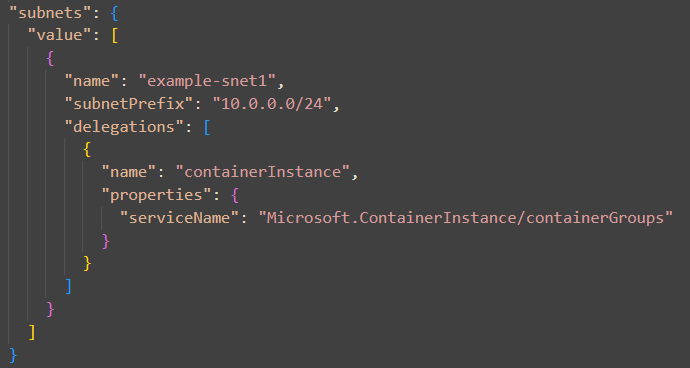
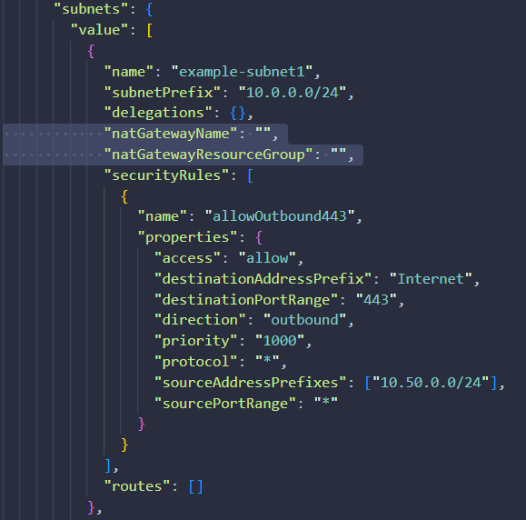

# bicep-vnet-module

This repository contains a virtual network module with support for looping subnets, network security groups, and route tables.


## What does the module support?

The following features are supported:

- Subnet loop: There is a built-in loop for subnets, network security groups, and route tables.
They all loop using the same list, and network security groups and route tables are not conditional at the moment.

- Subnet delegation: For each subnet in the loop, there is an option to delegate it to a specific Azure service

    - To find the currently available delegations for your subnet:

  ```PowerShell
    az network vnet subnet list-available-delegations -l "location" -g "ResourceGroupExample" -o table
  ```

- NAT Gateway: For each subnet in the loop, there's an option to a attach a NAT gateway.
    - In order to attach a NAT gateway, the parameters "natGatewayName", and "natGatewayResourceGroup" must be filled in.

    - These values are conditionals, if they are left empty a NAT gateway will not be attached.
    Note that the NAT gateway currently must reside in the same subscription as the virtual network deployment.

    


## Required parameters

- virtualNetworkName string
- virtualNetworkAddressPrefixes array
- subnets array
- subnets.name string
- subnets.subnetPrefix


## Optional parameters
- location string
- subnet.delegations
- subnet.natGatewayName
- subnet.natGatewayResourceGroup
- subnet.securityRules array
- subnet.routes array
- tags object


## How to deploy

  ```PowerShell
az group create -n "ResourceGroupExample" -l "location"
  ```

  ```PowerShell
    az deployment group create -g "ResourceGroupExample" -f .\virtual-network\main.bicep -p .\virtual-network\vnetParameters.json
  ```